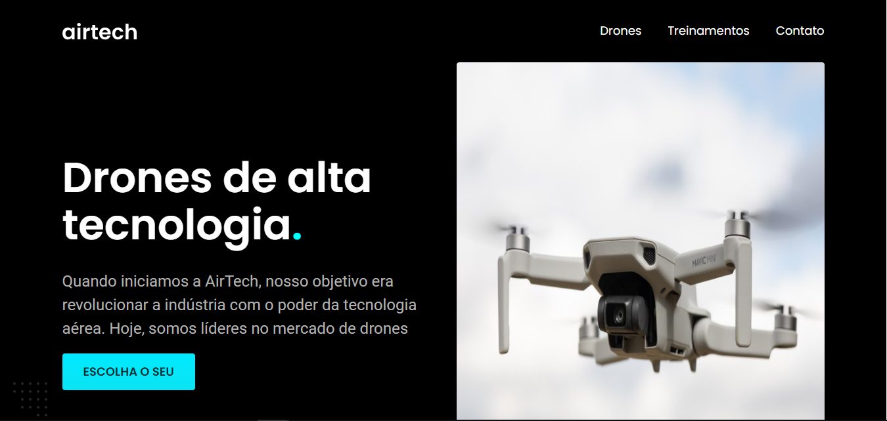

<h1 align="center">Airtech</h1>

<p align="center">Projeto pessoal - Site de drones</p>

<p align="center">
  <a href="#licença">Licença</a> • 
  <a href="#objetivo">Objetivo</a> •
  <a href="#capturas-de-tela">Capturas de Tela</a> • 
  <a href="#tecnologias-utilizadas">Tecnologias Utilizadas</a> • 
  <a href="#instruções-de-instalação">Instruções de Instalação</a> •
  <a href="#contribuição">Contribuição</a> • 
  <a href="#autor">Autor</a>
</p>

<h4 align="center"> 
  Status: Concluído
</h4>

## Licença
[](URL_DA_LICENÇA) 

Este projeto está sob a licença Mit License- veja o arquivo [LICENSE.md](LICENSE.md) para mais detalhes.

## Objetivo do Projeto
Bem-vindo ao AirTech, meu projeto pessoal de drones apresentado neste repositório. Desenvolvi este site utilizando HTML, CSS e JavaScript, com ênfase em design UI/UX. No AirTech, os usuários podem explorar e selecionar entre três modelos distintos de drones, cada um com suas próprias características únicas, ou escolher entre dois tipos de treinamentos especializados. Além disso, o site inclui uma seção exclusiva para orçamentos e contato, visando proporcionar uma experiência completa e intuitiva aos visitantes interessados no fascinante universo dos drones. Sinta-se à vontade para explorar e interagir!

## Capturas de Tela

<table>
  <tr>
    <td align="center">Versão para PC</td>
    <td align="center">Versão Mobile</td>
  </tr>
  <tr>
    <td></td>
    <td></td>
  </tr>
</table>

## Tecnologias Utilizadas
Neste projeto, foram utilizadas as seguintes tecnologias:

- HTML
- CSS
- JavaScript

## Resultado
Acesse o site pronto neste link: [airtech](https://jefelipe.github.io/airtech/)

## Instruções de Instalação e Execução

Aqui estão as instruções para executar e visualizar o projeto em diferentes dispositivos:


### Clone do Repositório
Para obter uma cópia local deste projeto, você pode clonar o repositório para a sua máquina usando o seguinte comando no terminal:

```bash
git clone https://github.com/jefelipe/airtech.git
```

### Versão para PC

1. Clone o repositório para a sua máquina local.
2. Abra o arquivo `index.html` em um navegador da web.
3. Você verá a versão para PC do projeto.

### Versão Mobile

1. Clone o repositório para a sua máquina local.
2. Abra o arquivo `index.html` em um navegador da web.
3. Redimensione a janela do navegador para simular a exibição em dispositivos móveis.
4. Você verá a versão mobile do projeto.

## Contribuição
Sinta-se à vontade para contribuir para este projeto. Se você deseja adicionar novos recursos, corrigir bugs ou melhorar o design, crie um fork do repositório, faça suas alterações e envie um pull request.

## Autor

Jean Felipe

- Site pessoal: [https://jefelipe.github.io/](https://jefelipe.github.io/)
- LinkedIn: [Perfil do LinkedIn](https://www.linkedin.com/in/jean-felipe)
- GitHub: [Perfil do GitHub](https://github.com/jefelipe)


Se tiver alguma dúvida ou precisar de assistência adicional, fique à vontade para entrar em contato com o autor.